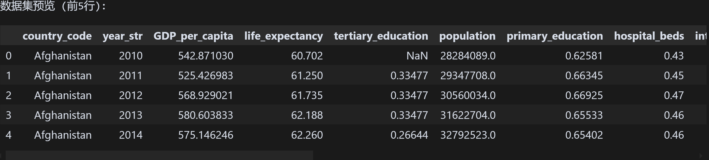
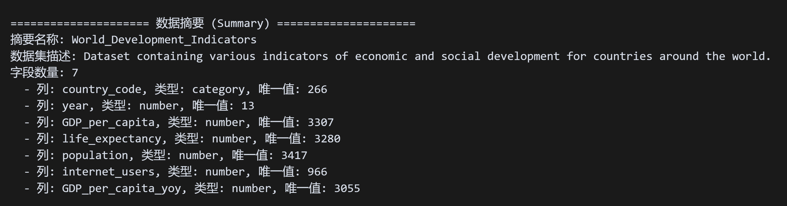
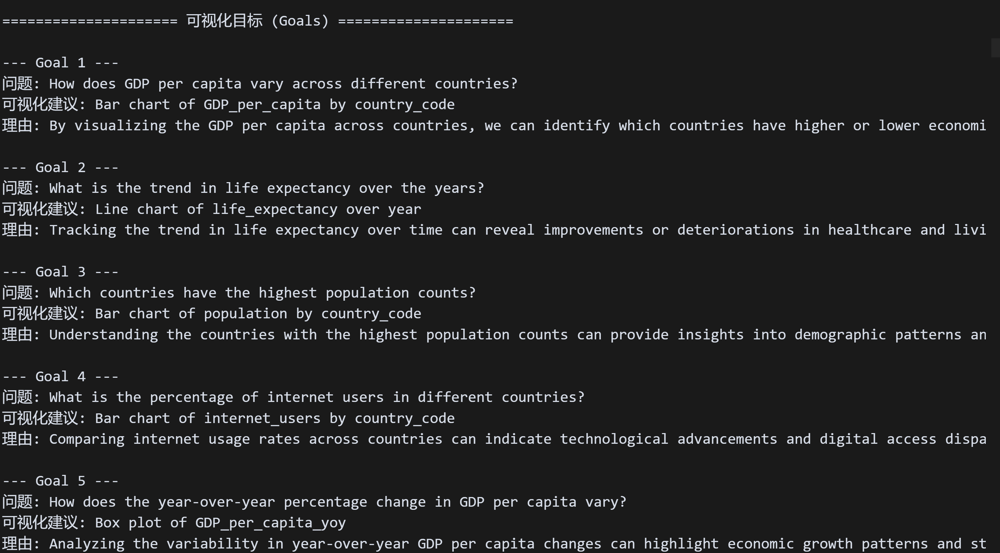
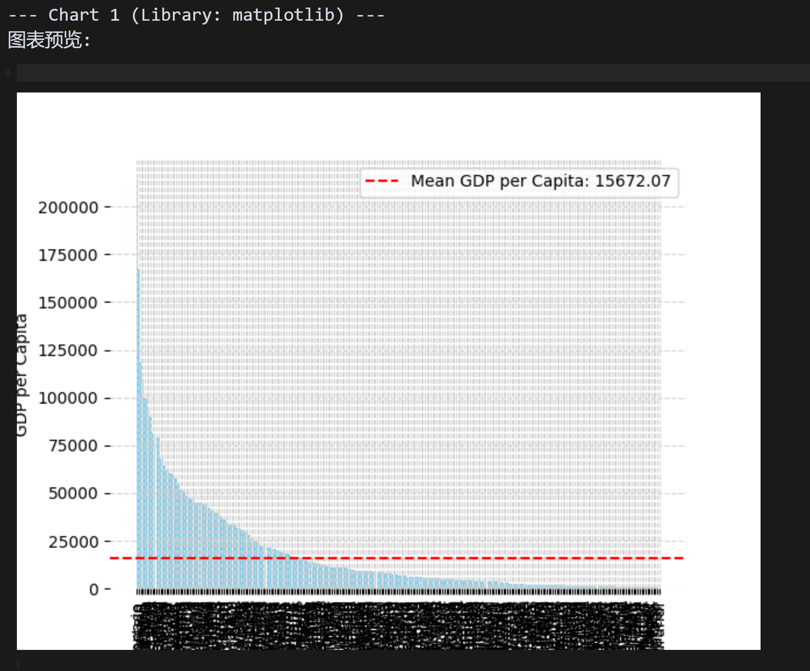
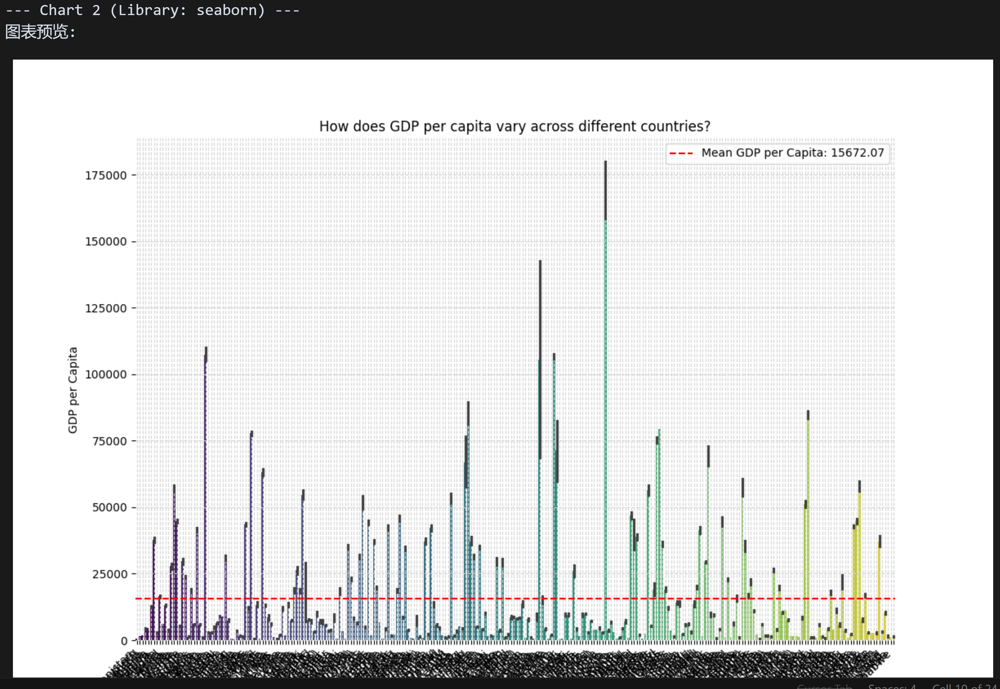
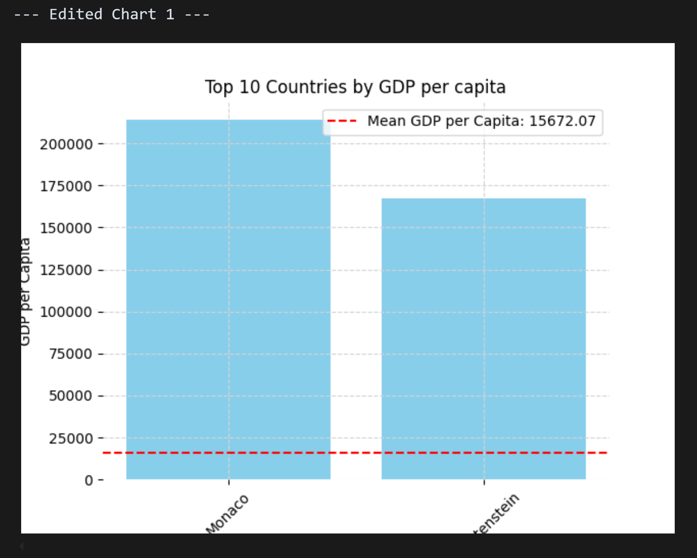
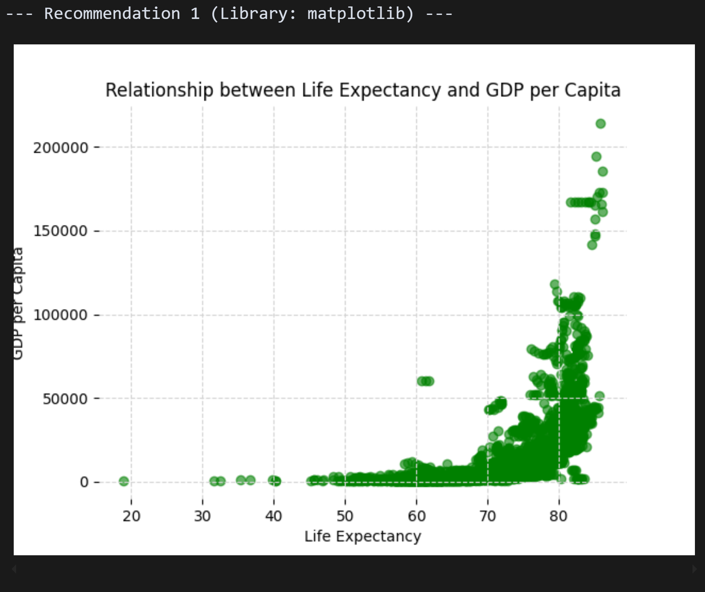

# 实验报告：基于LIDA的开源可视化代码复现与功能测试
**——个人作业三（人工智能与可视化）**

> 丁家超 202200300111
## 1. 实验目的
本实验的主要目的如下：
- 学习并理解LIDA项目的系统架构与核心功能。
- 成功部署LIDA开源代码，并配置相应的运行环境。
- 利用世界银行发展指标数据集，对LIDA的至少三个核心功能进行测试与评估。
- 详细记录实验过程，分析测试结果，评估LIDA在实际数据可视化任务中的表现。
- 撰写实验报告，总结实验过程、遇到的问题、解决方案以及对AI驱动数据可视化的思考。

## 2. LIDA项目概述

### 2.1 LIDA简介
LIDA (Language Interface for Data Analysis) 是由微软开发的开源项目，旨在通过自然语言交互赋能数据分析和可视化。它利用大型语言模型（LLM）的能力，将用户的自然语言查询转化为结构化的数据分析操作和可视化结果。LIDA的核心设计理念是简化数据分析流程，使其如同与数据分析专家进行对话般直观高效。

### 2.2 LIDA核心功能
根据官方文档与社区资料，LIDA主要具备以下核心功能：
- **数据总结 (Summarization):** 自动分析加载的数据集，提取关键统计信息、数据类型、潜在分布特征等，并生成自然语言形式的数据摘要。
- **可视化目标生成 (Goal Generation):** 基于数据摘要和潜在的用户分析意图，自动推荐一系列有意义的可视化目标或分析问题。
- **可视化图表生成 (Visualization Generation):** 根据选定或自动生成的可视化目标，利用LLM生成相应的可视化代码（例如，使用Vega-Lite, Matplotlib, Seaborn等库），并渲染图表。
- **可视化编辑 (Visualization Editing):** 允许用户通过自然语言指令对已生成的图表进行修改，如更改图表类型、颜色、标签等。
- **可视化解释 (Visualization Explanation):** 对生成的可视化图表进行解读，用自然语言解释图表所呈现的信息和趋势。
- **可视化评估 (Visualization Evaluation):** 评估生成的可视化图表的质量，包括其清晰度、信息表达的有效性等。
- **可视化推荐 (Visualization Recommendation):** 基于当前分析上下文和用户潜在需求，推荐其他相关的可视化图表或分析视角。

## 3. 实验环境配置与代码部署

### 3.1 硬件与软件环境
- **操作系统:** Windows 11 (版本: win32 10.0.26120)
- **Python版本:**  Python 3.8 
- **主要工具:** Jupyter Notebook
- **核心依赖库:**
    - `lida`: LIDA核心库
    - `openai`: 用于与OpenAI API交互
    - `pandas`: 数据处理库
    - LIDA项目 `requirements.txt` 文件中列出的其他依赖项。

### 3.2 LIDA的安装与测试代码准备

**步骤一：安装LIDA库**
本次实验中，LIDA库通过pip命令直接从Python包索引(PyPI)安装到本地Python环境：

```bash
pip install -U lida
```
此命令会安装LIDA库及其相关依赖。

**步骤二：配置OpenAI API密钥**
LIDA的核心功能依赖大型语言模型，本实验选用OpenAI GPT模型，因此需要配置API密钥。
1.  在LIDA项目实验代码（如`lida_worldbank_test.ipynb`）所在目录创建一个名为 `.env` 的文件。
2.  在该文件中添加以下内容，并将 `your_api_key_here` 替换为有效的OpenAI API密钥：
    ```
    OPENAI_API_KEY=your_api_key_here
    ```

**步骤三：准备测试代码与数据集**
本实验的核心测试逻辑在用户编写的Jupyter Notebook文件 `lida_worldbank_test.ipynb` 中实现。该文件被我上传至我的[代码仓库](https://github.com/jiachaoDing/Vis_homework3.git)

实验使用的数据集仍为预处理后的世界银行发展指标数据 (`world_bank_processed.csv`)。
数据集初步检视如下：




该数据集包含 **3458 行 和 17 列**，涵盖国家代码、年份、人均GDP、预期寿命、人口、互联网用户比例及这些指标的同比变化率等。数据中存在缺失值（NaN）。
为简化测试，后续LIDA功能测试中选取了数据子集，包含列: `['country_code', 'year', 'GDP_per_capita', 'life_expectancy', 'population', 'internet_users', 'GDP_per_capita_yoy']`。

### 3.3 LIDA 初始化
在Jupyter Notebook中，LIDA的初始化过程如下：
```python
import os
from dotenv import load_dotenv
from lida import Manager, TextGenerationConfig
from lida.utils import llm_utils # 推荐使用此路径导入

load_dotenv() # 加载配置的API密钥
OPENAI_API_KEY = os.getenv("OPENAI_API_KEY")

# 实例化LIDA Manager，指定使用OpenAI的gpt-3.5-turbo模型
lida = Manager(text_gen = llm_utils.get_llm_provider("openai", api_key=OPENAI_API_KEY, model="gpt-3.5-turbo"))
```
至此，LIDA已配置完毕，可进行功能测试。

## 4. 功能性测试与分析

本部分将对LIDA的各项主要功能进行测试和分析，包括数据总结、可视化目标生成、图表生成、图表编辑、图表解释、图表评估以及可视化推荐。

### 4.1 测试一：数据总结 (Summarization)

**4.1.1 测试目的**
验证LIDA对所提供数据集进行自动分析和总结的能力，包括识别字段属性、统计特征并生成描述性摘要。

**4.1.2 测试过程**
通过调用`lida.summarize()`方法实现数据总结：
```python
# file_path 指向 "world_bank_processed.csv"
summary = lida.summarize(
    data=file_path,
    summary_method="default"
)
```

**4.1.3 实际输出与分析**
LIDA生成的数据摘要信息如下：



**分析：** LIDA准确识别了选定子集的字段及其数据类型，并统计了各字段的唯一值数量。数据集的整体描述简洁明了，为后续的数据探索奠定了良好基础。

### 4.2 测试二：可视化目标生成 (Goal Generation)

**4.2.1 测试目的**
评估LIDA基于数据摘要自动推荐有意义且多样化的可视化目标的能力。

**4.2.2 测试过程**
将上一步生成的`summary`对象传递给`lida.goals()`方法，请求生成5个可视化目标：
```python
goals = lida.goals(
    summary=summary,
    n=5
)
```

**4.2.3 实际输出与分析**
LIDA生成的可视化目标示例如下：



**分析：** LIDA推荐的可视化目标具有多样性，覆盖了比较分析、趋势分析等多个维度，并给出了合理的图表类型建议及理由。

### 4.3 测试三：可视化图表生成 (Visualization Generation)

**4.3.1 测试目的**
检验LIDA根据指定目标（自动生成或用户自定义）生成可视化图表的能力。

**4.3.2 测试过程**
调用 `lida.visualize()` 方法，传入 `summary` 和一个具体 `goal并尝试使用不同的库（ matplotlib, seaborn）生成图表。`。

**4.3.3 实际输出与分析**
在尝试生成“各国人均GDP的条形图”时，由于数据集中国家数量众多，LIDA使用两个库生成的图表在X轴上展示所有国家名称时，导致标签严重重叠，无法辨识。这表明LIDA在默认情况下，对于高基数类别的轴标签处理尚有不足。
*(图像描述：一张条形图，X轴国家名称因数量过多而完全挤压堆叠，无法阅读。)*






### 4.4 测试四：可视化编辑 (Visualization Editing)

**4.4.1 测试目的**
评估LIDA通过自然语言指令修改已生成图表的能力，特别关注其在处理涉及数据筛选的复杂指令时的表现。

**4.4.2 测试过程**
针对X轴标签混乱的图表，尝试使用LIDA的编辑功能，想要通过指令 `["Make the chart title 'Top 10 Countries by GDP per capita' and show only the top 10 countries by GDP per capita"]` 进行修正。

**4.4.3 实际输出与分析**
LIDA未能完全准确执行此编辑指令。修改后的图表虽然可能更新了标题，但在数据筛选上仅显示了人均GDP最高的前两个国家，而非预期的前10个国家。
*(图像描述：一张条形图，标题已更新，但X轴仅显示两个国家名称及其条形。)*



此现象表明，LIDA（或其依赖的GPT-3.5模型）在理解和执行包含多步骤操作或需要精确数据筛选的复杂编辑指令时，其准确性和鲁棒性尚有提升空间。用户推测使用GPT-4模型可能会有所改善。


### 4.5 测试五：可视化解释 (Visualization Explanation)

**4.5.1 测试目的**
检验LIDA对生成（或编辑后）的图表进行文字解读的能力。

**4.5.2 测试过程**
对编辑后的图表（即使未完全符合预期）调用 `lida.explain()` 方法。

**4.5.3 实际输出与分析**
LIDA能够对当前显示的图表内容生成解释。

```
===================== 图表解释 (Explanation) =====================
[
    [
        {
            "section": "accessibility",
            "code": "None",
            "explanation": "The chart is a bar chart with sky blue bars representing GDP per capita for each country. The x-axis shows the country codes, and the y-axis represents GDP per capita. The goal of the chart is to visualize and compare GDP per capita values across different countries. The main insight is the relative GDP per capita values of different countries."
        },
        {
            "section": "transformation",
            "code": "data_sorted = data.sort_values('GDP_per_capita', ascending=False)",
            "explanation": "This section sorts the data by GDP per capita in descending order, which helps in arranging the data for plotting in a meaningful way."
        },
        {
            "section": "visualization",
            "code": "plt.bar(data_sorted['country_code'], data_sorted['GDP_per_capita'], color='skyblue')\nplt.xlabel('Country Code')\nplt.ylabel('GDP per Capita')\nplt.axhline(data['GDP_per_capita'].mean(), color='red', linestyle='--', label=f'Mean GDP per Capita: {data['GDP_per_capita'].mean():.2f}')\nplt.legend()\nplt.xticks(rotation=90)\nreturn plt",
            "explanation": "This section creates the bar chart using the sorted data. It sets the x-axis as country codes and y-axis as GDP per capita. An average GDP per capita line is added in red dashed line style. The legend displays the mean GDP per capita value. The x-axis labels are rotated for better readability."
        }
    ]
]
```
**分析：** LIDA的可视化解释功能输出采用三层结构化设计，将一个人均GDP条形图的生成过程分解为**可访问性描述、数据转换和可视化**实现三个模块：
	首先描述了图表的基本特征（天蓝色条形图展示各国人均GDP对比），
	然后展示了数据预处理代码（按GDP降序排列），
	最后提供了完整的matplotlib绘图代码（包含轴标签、均值参考线、标签旋转等优化细节）。
整个输出体现了LIDA较强的代码生成和技术解释能力，能够将复杂的可视化过程透明化，为用户提供了从数据处理到图表渲染的完整技术视图，具有良好的教育价值和调试支持功能。

### 4.6 测试六：可视化评估 (Visualization Evaluation)

**4.6.1 测试目的**
评估LIDA对图表质量进行多维度评分的能力。

**4.6.2 测试过程**
对图表调用 `lida.evaluate()` 方法。

**4.6.3 实际输出与分析**
LIDA从多个维度对图表进行了评分。
```
===================== 图表评估 (Evaluations) =====================

--- Evaluation 1 ---
[
    {
        "dimension": "bugs",
        "score": 8,
        "rationale": "The code does not have any syntax errors or logical bugs. However, there is a potential issue with the axhline function where the mean GDP per capita is calculated using the entire dataset, which may not be appropriate."
    },
    {
        "dimension": "transformation",
        "score": 7,
        "rationale": "The data is sorted based on GDP per capita, which is appropriate for the visualization goal. However, additional transformations such as filtering or grouping could provide more insights."
    },
    {
        "dimension": "compliance",
        "score": 8,
        "rationale": "The code partially meets the specified goal by showing how GDP per capita varies across different countries. However, it could be improved by providing more context or comparison."
    },
    {
        "dimension": "type",
        "score": 6,
        "rationale": "Using a bar chart to show GDP per capita across different countries is a common and acceptable choice. However, a scatter plot or choropleth map could be more effective in visualizing this type of data."
    },
    {
        "dimension": "encoding",
        "score": 7,
        "rationale": "The data is encoded appropriately with GDP per capita on the y-axis and country code on the x-axis. The color encoding for the bars is also suitable."
    },
    {
        "dimension": "aesthetics",
        "score": 7,
        "rationale": "The plot is clean and easy to read with appropriate labels and colors. However, the rotation of x-axis labels could be improved for better readability."
    }
]
```
**分析：**LIDA的图表评估功能采用六维度评估体系对人均GDP条形图进行综合质量分析：

1. 在代码缺陷维度给出8分，认为语法正确但均值计算存在数据范围问题；

2. 数据转换维度7分，肯定了GDP降序排列的合理性但建议增加筛选分组操作；
3. 目标合规维度8分，认为基本实现跨国比较目标但缺乏上下文；
4. 图表类型维度6分（最低分），指出条形图虽可接受但散点图或地图可视化可能更有效；
5. 数据编码维度7分，认可轴映射和颜色编码的恰当性；
6. 美学效果维度7分，评价图表整洁易读但X轴标签旋转仍需改进。

整体平均7.2分的评估结果既肯定了基本功能实现，又精准识别了标签可读性、图表类型选择等关键问题，与实验中发现的实际问题高度吻合，体现了LIDA在可视化质量控制方面的专业分析能力。

### 4.7 测试七：可视化推荐 (Visualization Recommendation)

**4.7.1 测试目的**
检验LIDA基于当前分析上下文推荐其他相关可视化图表或分析视角的能力。

**4.7.2 测试过程**
在完成前述图表生成和评估后，调用 `lida.recommend()` 方法，让LIDA基于当前的数据摘要和分析上下文自动推荐相关的可视化方案。

**4.7.3 实际输出与分析**
LIDA推荐了一个展示"预期寿命与人均GDP关系"的散点图，使用matplotlib库实现。



这个推荐相当出色。首先，LIDA选择散点图来展示两个连续变量的关系是完全正确的，这比之前那个标签重叠的条形图要合适得多。更重要的是，它发现了数据中一个很有意思的关联——经济发展水平与人口健康状况的关系，这为我们提供了新的分析角度。

从技术实现来看，生成的图例设计得很好，清晰易读，X轴和Y轴的映射也很合理。相比之前遇到的问题，这个散点图避免了标签显示的困扰，同时充分利用了数据的多维特性。

这个推荐功能让我印象深刻的是它的"智能性"——不仅仅是简单地换个图表类型，而是真正理解了数据背后的含义，从单纯的GDP排名比较转向了更有分析价值的变量关系探索。这种从描述性分析向关系性分析的引导，确实体现了AI工具在数据探索方面的潜力。

**分析：** LIDA的可视化推荐功能表现超出预期，不仅解决了之前图表的技术问题，更重要的是展现了对数据内在关联的洞察能力。通过推荐预期寿命与GDP的关系分析，为用户打开了新的研究思路，证明了AI驱动的可视化工具在引导深度数据探索方面的实用价值。


## 5. 实验总结与讨论

### 5.1 LIDA的优势与局限性

通过这次全面的功能测试，LIDA展现出了作为AI驱动可视化工具的价值，但同时也暴露了一些不足。

**LIDA的主要优势：**

最突出的优势是它真正降低了数据可视化的门槛。即使不会编程的用户也能通过简单的自然语言描述生成专业的图表，这在传统的数据分析工具中是很难实现的。整个流程的自动化程度也相当高，从数据摘要到图表生成，再到后续的解释和评估，基本上可以一气呵成。

特别值得称赞的是它的功能完整性。LIDA不只是一个简单的图表生成器，而是提供了一套完整的数据可视化工作流，包括数据理解、目标设定、图表生成、质量评估和进一步推荐。在测试中，它推荐的预期寿命与GDP关系的散点图就很好地体现了这种智能化的分析思维。

另外，LIDA的灵活性也不错，支持不同的LLM后端和可视化库，这为用户提供了更多选择空间。

**实验中发现的局限性：**

最明显的问题是对复杂指令的处理能力不足。当我们要求LIDA"显示Top 10国家"时，它只显示了前两个国家，这说明在理解和执行包含多步骤操作的指令时还有很大改进空间。这个问题很可能与底层使用的GPT-3.5模型能力有关。

另一个比较突出的问题是对高基数类别数据的处理。生成包含所有国家的条形图时，X轴标签完全重叠无法阅读，这在实际应用中是不可接受的。虽然LIDA在代码中加了标签旋转，但面对几十个国家的数据时这种方法显然不够。

此外，LIDA在数据预处理方面的能力还比较有限。对于复杂的数据清洗和特征工程，用户仍然需要自己动手。而且通过自然语言进行精细化的图表定制也比较困难，很多细节调整还是需要直接修改代码。

### 5.2 实验过程中的思考

这次实验让我对AI驱动的数据可视化工具有了更深入的理解。

首先是环境配置的重要性。LIDA的安装和API配置虽然不复杂，但每一步都很关键，特别是OpenAI API密钥的正确配置直接影响所有功能的使用。

更重要的是，我深刻体会到了"提示工程"的挑战性。给LIDA下指令看似简单，但要让它准确理解并执行你的意图其实并不容易。指令的措辞、结构都会影响最终结果。这也反映了当前LLM技术的局限性——即使是相对明确的指令，执行效果也可能不尽如人意。

另外，实验过程中我发现，要获得满意的可视化结果往往需要多次迭代。第一次生成的图表很可能存在各种问题，需要通过编辑、重新生成等方式逐步优化。这提醒我们，AI工具目前更适合作为辅助手段，而不是完全替代人工判断。

最后，底层模型的选择对工具性能有决定性影响。使用GPT-3.5的LIDA在某些复杂任务上表现不佳，如果换成GPT-4可能会有明显改善。这也说明了AI工具的发展很大程度上依赖于基础模型技术的进步。


## 6. 结论


本实验通过直接安装LIDA库并结合用户编写的测试代码，对LIDA在世界银行数据集上的各项主要功能进行了全面的测试。LIDA在数据总结、基础可视化目标生成、图表解释、评估和推荐方面展现了其作为AI驱动可视化工具的便捷性与潜力。然而，在生成包含大量类别的图表时，默认的可视化效果存在不足（如X轴标签重叠）。更重要的是，在图表编辑等高级功能上，当指令涉及较复杂的数据筛选和重新渲染时（如要求显示Top 10国家数据），基于GPT-3.5的LIDA未能准确达成预期，这揭示了其在复杂指令遵循和精确数据操作方面的当前局限性。
总体而言，LIDA为AI驱动的可视化提供了一个功能较为全面的框架，但其鲁棒性和高级功能的表现高度依赖于底层LLM的能力，并且在某些场景下仍需用户进行细致的引导或后续调整。

## 7. 参考文献
- LIDA项目GitHub仓库: https://github.com/microsoft/lida (虽然本项目直接通过pip安装，但源码仓库仍是重要参考)
- LIDA相关论文，如: Arora, et al. "LIDA: A Tool for Automatic Generation of Grammar-Agnostic Visualizations and Infographics using Large Language Models." arXiv preprint arXiv:2303.02927 (2023).
- 世界银行公开数据: https://data.worldbank.org/
- Vega-Lite文档: https://vega.github.io/vega-lite/docs/
- OpenAI API文档: https://platform.openai.com/docs
- Python Package Index (PyPI) - lida: https://pypi.org/project/lida/ (LIDA库的发布地址)

